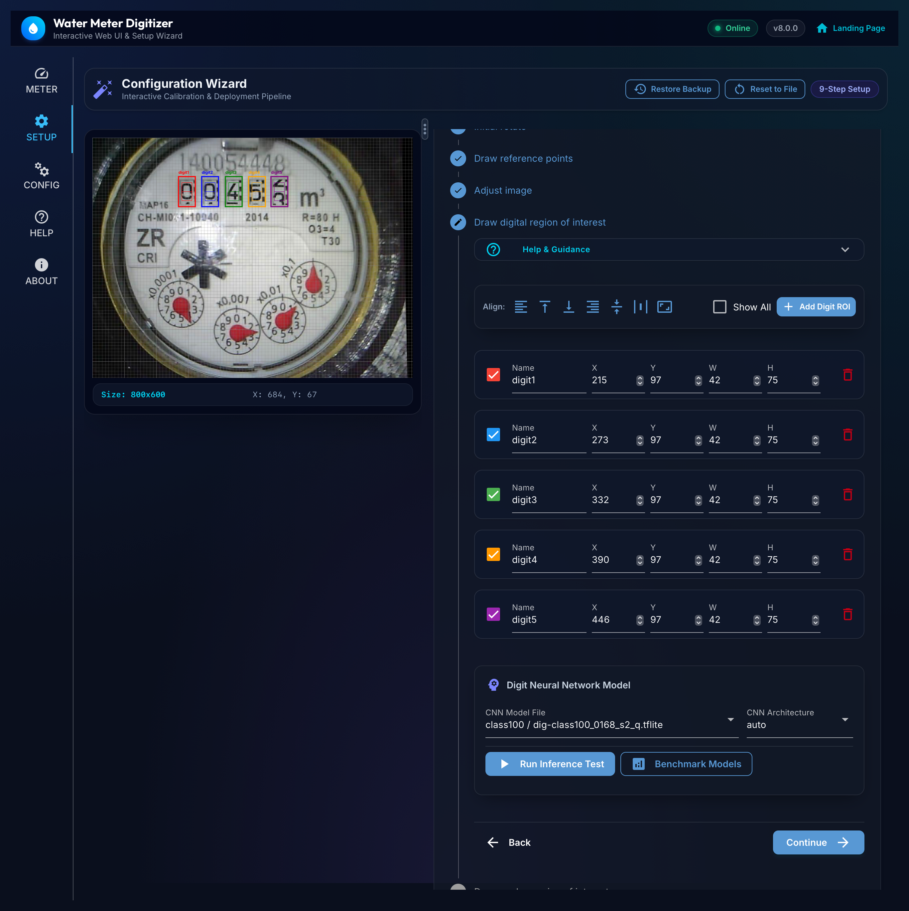

# Web GUI User Guide & Setup Manual

The **Water Meter Digitizer** features a built-in web interface served on port `3000` (accessible by default at `http://localhost:3000`).

---

## Table of Contents

1. [Overview & Navigation](#overview--navigation)
2. [Meter Page (Live Readouts)](#meter-page-live-readouts)
3. [Setup Wizard (Step-by-Step)](#setup-wizard-step-by-step)
   - [Step 1: Download Image](#step-1-download-image)
   - [Step 2: Initial Rotate](#step-2-initial-rotate)
   - [Step 3: Reference Points](#step-3-reference-points)
   - [Step 4: Image Adjustments & Alignment](#step-4-image-adjustments--alignment)
   - [Step 5: Digital Region of Interest (ROIs)](#step-5-digital-region-of-interest-rois)
   - [Step 6: Analog Region of Interest (ROIs)](#step-6-analog-region-of-interest-rois)
   - [Step 7: Meters Definition](#step-7-meters-definition)
   - [Step 8: Services & Integrations](#step-8-services--integrations)
   - [Step 9: Final Review & Save](#step-9-final-review--save)
4. [Interactive Canvas Controls](#interactive-canvas-controls)
5. [Config Editor Page](#config-editor-page)
6. [Troubleshooting & FAQs](#troubleshooting--faqs)

---

## Overview & Navigation

The interface is divided into a collapsible left sidebar and the main workspace:

| Tab | Icon | Purpose |
|---|---|---|
| **Meter** | `speed` | View live readings, trigger manual readouts, and inspect intermediate CNN outputs. |
| **Setup** | `settings` | Interactive 9-step wizard for camera capture, alignment, ROI bounding boxes, meters, and services. |
| **Config** | `manufacturing` | Raw `config.ini` text editor with syntax verification, JSON schema inspection, and reload/save tools. |
| **Help** | `help_outline` | Built-in guide and keyboard/mouse shortcut reference. |
| **About** | `info` | Version information and system summary. |

---

## Meter Page (Live Readouts, History & Time Machine)

The **Meter** tab provides three integrated operational views:

### 1. Live Readouts
- **Trigger Readout**: Click the refresh button to capture a frame and perform immediate inference.
- **Save Intermediate Images**: Checkbox to save rotated, aligned, and cropped ROI images to `/image/{name}` for diagnostics.
- **Meter Cards**: Displays current readings with units (e.g. `0300.957 m³`), timestamp, processing duration, and flow status.
- **Sub-digit Readouts**: Inspect the individual classification confidence and predictions for each digital drum digit and analog needle dial.

### 2. Consumption History
- **Interval Breakdown**: Visual bar charts showing consumption aggregated by `Hourly`, `Daily`, and `Weekly` buckets.
- **Cumulative Mode**: Toggle running total curves to track total volume consumed over selected time windows.
- **Summary Metrics**: Highlighting total consumed volume, average rate, peak consumption periods, and baseline references.

### 3. Time Machine & Frame Inspector
The **Time Machine** provides an interactive chronological frame scrubber and visual comparison inspector:
- **Chronological Scrubber**: Drag or play across recorded historical snapshot frames. The timeline is oriented from left (Oldest / Past) to right (Latest / Live) with explicit timestamp labels.
- **Side-by-Side Comparison**: Displays the selected **Historical Frame** on the left alongside the **Latest Live Frame** on the right in standardized viewports, with formatted UTC timestamps directly beneath both frames.
- **Historical ROI Breakdown**: Integrated detection cards for **Digital Drums** and **Analog Dials** display the exact digit predictions and confidence percentages for the active Historical Frame.
- **Time-lapse Playback**: Auto-advance through historical frames with a live countdown timer badge (`⏱️ Next: X.Xs`) and selectable playback speeds (`10s`, `5s`, `3s`, `2s`, `1s`, `0.5s`).
- **Filters & Storage Management**:
  - **Frames Only**: Switch between all recorded database records and snapshot-bearing frames.
  - **Anomalies Only**: Filter specifically for frames where recognition errors or low-confidence readings occurred.
  - **Prune Tool**: 1-click button to reclaim disk space within configured storage budgets.

---

## Setup Wizard (Step-by-Step)

The **Setup** tab provides a 9-step guided configuration wizard. On the left is the **Interactive Image Canvas** (showing real-time coordinates, image dimensions, and SVG ROI overlays), and on the right is the **Step Navigator**.

The top toolbar of the Setup Wizard includes quick recovery tools:
- **Reset to File (`restart_alt`)**: Discards all unsaved in-memory wizard modifications and re-initializes all steps, inputs, and ROIs directly from the current `config.ini` file on disk.
- **Restore Backup (`settings_backup_restore`)**: Opens a backup selection modal to immediately restore all wizard settings, parameters, and ROI definitions from any historical backup snapshot stored in `/config/backups/`.

### Step 1: Download Image
- **Camera URL**: Enter the HTTP snapshot endpoint (e.g. `http://192.168.1.100/capture` or `file:///config/original.jpg`).
- **Timeout**: Set the network request timeout in seconds (1–60s).
- **Download Button**: Fetches a frame from the camera. If the camera is unreachable or times out, the interactive canvas displays an offline placeholder graphic with retry instructions without crashing the page.

### Step 2: Initial Rotate
- **Coarse Rotation**: Rotate the image in 90° increments (`0°`, `90°`, `180°`, `270°`) so the meter numbers and dials are oriented right-side up.

### Step 3: Reference Points
- Aligning the camera capture is crucial to compensate for minor vibration or camera repositioning.
- The system requires **3 distinct visual landmarks** (e.g. screws, text labels like `m³`, dial centers, or logo corners).
- **Adding a Reference**: Click `+` to add a reference point, then click and drag on the interactive image to define its bounding box.
- **Color Coding**: Each reference ROI is assigned a distinct color (Red, Blue, Green) matched across the checkbox list and canvas.

### Step 4: Image Adjustments & Alignment
- **Fine Rotation**: Adjust rotation by small fractional angles (e.g. `0.5°`).
- **Alignment Test**: Click **Test Alignment** to execute OpenCV affine transformation against the 3 reference markers.
- **Image Filters**: Adjust `Contrast`, `Brightness`, `Color`, and `Sharpness` multipliers.
- **Grayscale**: Toggle grayscale conversion.
- **AutoContrast**: Enable histogram equalisation with customizable lower and upper percentile cutoffs.
- **Glare & Specular Reflection Suppression**: Filter out glossy meter glass reflections and flash glare hotspots:
  - `clahe`: Contrast Limited Adaptive Histogram Equalization in LAB space.
  - `inpaint`: Fast Marching (Telea) specular mask inpainting to reconstruct obscured digits.
  - `illumination_normalize`: Division filter to smooth wide lighting gradients.
  - `combined`: Inpainting for extreme hotspots followed by CLAHE contrast enhancement.
  - **Apply to Cut Images (ROIs)**: Optionally apply localized suppression directly on individual digit and dial pointer crops.

### Step 5: Digital Region of Interest (ROIs)
- Define bounding boxes for mechanical drum digits or LCD numbers.
- **Add / Remove**: Use `+` and `-` buttons to manage digits (`digit1`, `digit2`, ...).
- **Positioning**: Drag a box on the interactive canvas or enter precise `X`, `Y`, `W`, `H` coordinates.
- **Alignment Tools**:
  - **Align Left / Right / Top / Bottom / Center**: Aligns selected ROIs along the specified edge or axis.
  - **Resize All**: Matches the dimensions of all selected ROIs to the first selected digit.
- **CNN Model**: Choose a pre-trained `.tflite` model from `/config/neuralnets/digital` (organized by architecture: `class100/`, `class11/`, `continuous/`, and `legacy/`). Quantized models (`_q.tflite` / `⚡ Int8`) are recommended for optimal edge CPU performance.
- **CNN Type**:
  - `auto`: Automatically detected from model shape.
  - `digital`: Standard classification (0–9 + invalid).
  - `digital100`: High-resolution continuous rolling digit model (0–99).
- **Test Inference**: Click **Test** to crop the ROIs, run inference on the selected model, and preview predicted digits with confidence percentages.
- **Benchmark Models**: Click **Benchmark Models** to open the side-by-side evaluation dialog. Compares all candidate models against the cropped ROI ground-truth images, displays latency in `ms`, per-ROI predictions, and ranks models by confidence and speed with 1-click **Apply**.

### Step 6: Analog Region of Interest (ROIs)
- Define circular bounding boxes for analog dial needles (`analog1`, `analog2`, ...).
- **Alignment Tools**: Use the same left/top/center alignment and size matching tools as digital ROIs.
- **CNN Model**: Choose a pre-trained `.tflite` model from `/config/neuralnets/analog` (organized by architecture: `class100/`, `continuous/`, and `legacy/`).
- **CNN Type**:
  - `auto`: Detected from model shape.
  - `analog`: 0–10 continuous angle prediction.
  - `analog100`: High-resolution 100-class angular prediction (0–9.99).
- **Test Inference**: Click **Test** to run needle angle detection and inspect real-time outputs.
- **Benchmark Models**: Click **Benchmark Models** to benchmark all analog models against the dial needles and select the most accurate candidate.

### Step 7: Meters Definition
- Define one or more named logical meters (e.g. `main`, `total`, `instant`).
- **Format Template**: Combine digit and analog variables (e.g. `{digit1}{digit2}{digit3}{digit4}.{digit5}{digit6}{analog1}`).
- **Consistency Checking**:
  - **Enabled**: Validates rate of consumption against previous reading.
  - **Max Rate Value**: Maximum allowed increment per reading interval.
  - **Allow Negative Rates**: Reject decreasing meter values.
- **Previous Value Handling**:
  - **Use Previous Value**: Automatically replace unreadable digits (`N`) with the last known valid reading. Supports both decimal numbers (e.g. `00452.9024`) and integer values.
  - **Max Age (Minutes)**: Expire cached previous values older than the threshold (`0` = no expiration).
- **Extended Resolution**: Append fractional sub-digit decimal places from the lowest analog needle.
- **Unit**: Custom unit string (e.g. `m³`, `L`, `kWh`).

### Step 8: Services & Integrations
- **Scheduled Background Poller**: Enable the internal async scheduler to trigger periodic readouts automatically (`IntervalSeconds`, `RunOnStartup`, `SaveImages`, `RetryIntervalSeconds`).
- **MQTT & Home Assistant Discovery**: Configure MQTT broker connection (`Broker`, `Port`, `Username`, `Password`, `ClientID`, `TopicPrefix`, `TLS`, `Retain`) and automatic Home Assistant entity discovery (`HomeAssistantDiscovery`, `DiscoveryPrefix`, `DeviceName`, `DeviceID`).
- **History Storage & Retention**: Select SQLite database or in-memory backend, data directory, retention days, and max records pruning.
- **Snapshots & Time Machine Archival**: Configure historical frame capture strategies and compression:
  - `Mode`: Storage policy (`smart_tiered`, `change_only`, `roi_strips_only`, `full_frames`, `disabled`).
  - `Format` & `Quality`: Output compression (`webp` or `jpeg`, quality factor 1–100).
  - `MaxDiskMB`: Maximum disk space ceiling in MB allocated for snapshot archives before automated pruning.
  - `IdleHeartbeatMinutes`: Max interval between snapshot captures during long zero-flow periods.
  - `AlwaysSaveOnAnomaly`: Ensures full frames are archived whenever recognition errors or low confidence occurs.
- **Zero-Flow Tracking & Leak Monitor**: Automatically detect continuous non-zero water usage sustained over time without quiet periods:
  - `ContinuousFlowHours`: Continuous flow duration threshold before triggering alert (e.g. `2.0` hours).
  - `MinLeakVolume`: Minimum cumulative volume required to flag leak (filters optical digit jitter).
  - `ResolveDebounceCount`: Number of consecutive zero readings required to auto-resolve active alerts.
  - `MaxHistoryEvents`: Maximum completed leak event logs retained in memory.
- **Global Settings**: Configure data directory and minimum confidence score threshold.

### Step 9: Final Review & Save
- Review the compiled configuration and live processed image.
- **Save Config**: Writes the configuration to `/config/config.ini`.
- **Save Reference Images**: Saves cropped reference marker landmark files to `/config`.
- **Take In Use**: Applies the configuration to the active runtime engine immediately.

---

## Interactive Canvas Controls

| Action | Control / Gesture |
|---|---|
| **Draw ROI Box** | Click & Drag on the image canvas |
| **View Coordinates** | Hover mouse over any pixel (displays `X: ...`, `Y: ...` in the HUD) |
| **Select ROI Coordinate** | Click on any pixel |
| **Toggle ROI Visibility** | Check / Uncheck the colored checkbox in the ROI table |
| **Show All / Hide All** | Toggle the `Show` master checkbox in the table header |

---

## Config Editor Page

For power users, the **Config** tab allows direct editing of the INI configuration:
- **Syntax Check (`verified`)**: Validates INI syntax and parameter types before saving.
- **Save (`save`)**: Writes changes directly to `config.ini`. Automatically generates a timestamped safety backup in `/config/backups/` before overwriting.
- **Undo (`undo`)**: Reverts the configuration to the immediately preceding backup snapshot in 1 click.
- **History (`manage_history`)**: Opens the **Configuration History** management dialog:
  - **Revisions Timeline**: Lists all automatic and manual backups with timestamps, relative age, file sizes, and labels.
  - **Inline Visual Diff (`difference`)**: Expands a syntax-highlighted, line-by-line unified diff against the current `config.ini` (green for additions `+`, red for removals `-`, cyan for chunk headers `@@`).
  - **Manual Snapshots**: Create named checkpoints (e.g. `Pre-Calibration`, `Winter-Settings`) for key milestones.
  - **Restore (`restore`)**: Restores the selected historical backup over `config.ini` (automatically capturing a pre-restore safety snapshot).
  - **Delete (`delete`)**: Removes unwanted backup files.
- **Take in Use (`reopen_window`)**: Hot-reloads the active runtime without restarting the container.
- **Show Parsed JSON (`preview`)**: Visualizes the parsed configuration hierarchy in formatted JSON.
- **Reload (`refresh`)**: Reverts unsaved changes in the editor from disk.

---

## Troubleshooting & FAQs

### Why does the canvas show "Camera Offline / Unreachable"?
- Check that the camera URL in Step 1 is correct and reachable from the container network.
- Verify camera authentication or network firewalls.
- Increase the timeout value (e.g. from `10s` to `30s`) for slow Wi-Fi camera modules.

### Why are digit bounding boxes shifting between captures?
- Ensure reference markers in Step 3 are placed on rigid, high-contrast, non-reflective landmarks.
- Ensure the reference images do not contain moving parts (like rotating needles or rolling numbers).

### Why does a digit show `N` (unreadable)?
- Ensure the ROI bounding box is centered tightly around the digit.
- Check contrast and sharpness in Step 4 or enable `AutoContrastCutImages`.
- Verify the correct CNN model file is selected.
