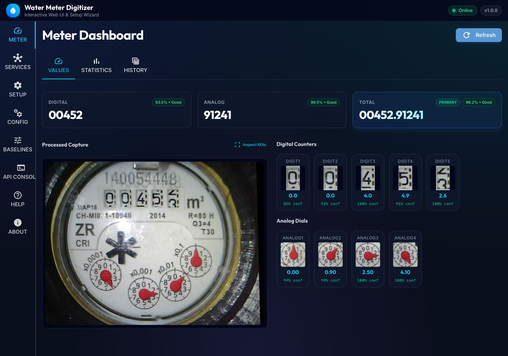

# 💧 Water Meter Digitizer

[](https://github.com/paulianttila/water-meter-digitizer/actions/workflows/ci.yml)
[](https://www.python.org/downloads/release/python-3110/)
[](https://hub.docker.com/r/paulianttila/water-meter-digitizer)
[](https://github.com/paulianttila/water-meter-digitizer)
[](LICENSE.md)

Automatically read analog needle dials and mechanical odometer digits from utility meters using a camera, lightweight computer vision, and Google LiteRT (TensorFlow Lite) neural network inference on edge devices.

> A modernized, completely rewritten, high-performance fork of the original [jomjol](https://github.com/jomjol) digitizer project.

---

## 🌟 Highlights

- **Mixed Meter Support** — Simultaneously reads mechanical odometer rolling drums, digital LCD counters, and circular analog needle dials in a single frame.
- **Predecessor Roll-Over Correction** — Automatically fixes ambiguous, half-turned numbers at roll-over boundaries using adjacent dial positions.
- **Zero-Flow Continuous Leak Monitor** — Automatically detects continuous non-stopping water consumption and triggers alarms.
- **Home Assistant & openHAB Ready** — Native MQTT Auto-Discovery, Energy & Water Dashboard integration, and MQTT bindings.
- **Time Machine Visual Scrubber** — Interactive historical frame playback with side-by-side comparison and difference heatmaps.
- **Edge & Docker Optimized** — High-performance inference with LiteRT worker pools on Raspberry Pi (ARM64) and x86_64 servers.

---

## 📸 Screenshots & Web Dashboard

<p align="center">
  
</p>

- **`/` (Web Dashboard)**: Live readings, primary metrics, confidence badges, cropped dial previews, and consumption charts.
- **Time Machine**: Interactive historical frame scrubber with side-by-side Historical vs. Live comparison and SSIM metrics.
- **Setup Wizard (`/setup`)**: 9-step guided visual calibration flow with live canvas, alignment markers, and backup restoration.

<p align="center">
  
</p>

---

## ⚡ Quick Start

### Docker Compose (Recommended)

```yaml
services:
  watermeter-digitizer:
    container_name: water-meter-digitizer
    image: paulianttila/water-meter-digitizer:latest
    restart: unless-stopped
    environment:
      - TZ=Europe/Helsinki
      - METER_LOG_LEVEL=INFO
    volumes:
      - ./config:/config
      - ./data:/data
    ports:
      - 3000:3000
    healthcheck:
      test: ["CMD", "python", "-c", "import urllib.request; urllib.request.urlopen('http://localhost:3000/healthcheck')"]
      interval: 30s
      timeout: 5s
      retries: 3
```

```bash
docker compose up -d
```
Open **`http://localhost:3000`** in your browser to access the dashboard and setup wizard!

---

## 📚 Documentation Hub (Project Wiki)

Detailed guides, API specifications, and calibration tutorials are available in the **[Project Wiki](docs/wiki/Home.md)**:

| Guide | Description |
| :--- | :--- |
| 🚀 **[Installation & Deployment](docs/wiki/Installation-&-Deployment.md)** | Docker Compose, Raspberry Pi / ARM64, and bare-metal `uv` setups. |
| 📷 **[Hardware & Camera Setup](docs/wiki/Hardware-&-Camera-Setup.md)** | ESP32-CAM, network cameras, lighting, and glare suppression. |
| 🧭 **[Web Dashboard Tour](docs/wiki/Web-Dashboard-Tour.md)** | Live readouts, consumption graphs, and Time Machine scrubber. |
| 🪜 **[Setup Wizard Manual](docs/wiki/Setup-Wizard-Guide.md)** | Step-by-step 9-step calibration workflow. |
| 💧 **[Zero-Flow Leak Detection](docs/wiki/Zero-Flow-Leak-Detection.md)** | Continuous leak monitoring, quiet windows, and reset triggers. |
| 🏡 **[Smart Home Integrations](docs/wiki/Smart-Home-Integrations.md)** | Home Assistant MQTT Discovery, Energy Dashboard, and openHAB. |
| 📡 **[MQTT Topic Reference](docs/wiki/MQTT-Topic-&-Payload-Reference.md)** | Topic schemas, JSON payloads, and retain flags. |
| 🔌 **[REST API Reference](docs/wiki/REST-API-Reference.md)** | Endpoints, query parameters, curl examples, and Swagger UI. |
| ⚙️ **[Configuration Reference](docs/wiki/Configuration-Reference.md)** | Full `config.ini` manual, `METER_*` environment overrides, and sample file. |
| 🛡️ **[Config Backups & History](docs/wiki/Config-Backups-&-Version-Control.md)** | Automatic safety backups, 1-click Undo, snapshots, and diffs. |
| 💾 **[Storage & Snapshot Pruning](docs/wiki/Storage-&-Snapshot-Pruning.md)** | SQLite database, WebP compression, and disk quota pruning. |
| 🔬 **[Architecture & Pipeline](docs/wiki/Architecture-&-Pipeline.md)** | Component decoupling and execution flow. |
| 🧠 **[Neural Network Models](docs/wiki/Neural-Network-Models.md)** | CNN architectures, LiteRT runtime, and thread pooling. |
| 🧮 **[Digit Roll-Over Math](docs/wiki/Digit-Roll-Over-&-Extended-Resolution.md)** | Predecessor consistency algorithms and fractional decimal math. |
| 🧪 **[Development & Testing](docs/wiki/Development-&-Testing.md)** | Local environment setup, test suites (`./run_tests.sh`), and code quality. |
| ❓ **[Troubleshooting & FAQ](docs/wiki/Troubleshooting-&-FAQ.md)** | Diagnostics matrix and frequently asked questions. |

---

## 🛠️ Developer Quick Start

For local development and running test suites:

```bash
# Install dependencies & run tests
uv sync
./run_tests.sh -a

# Start local server
export CONFIG_FILE=$(pwd)/config/config.ini
uv run python src/main.py
```
See **[DEVELOPER.md](DEVELOPER.md)** for more developer shortcuts.

---

## 📄 License

Distributed under the [GNU General Public License v3.0 (GPL-3.0)](LICENSE.md).
